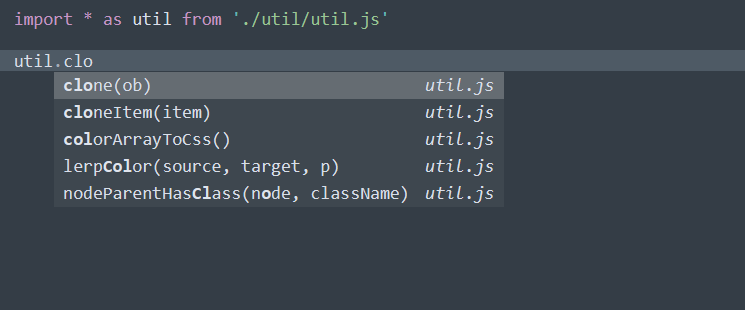
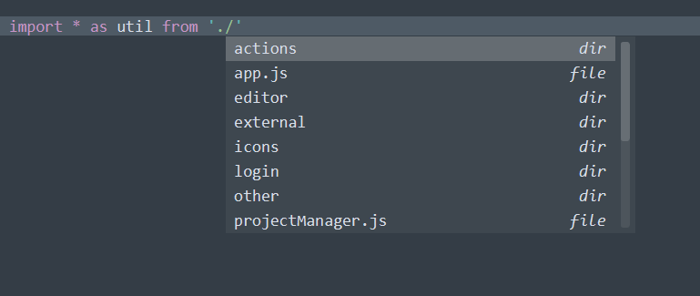
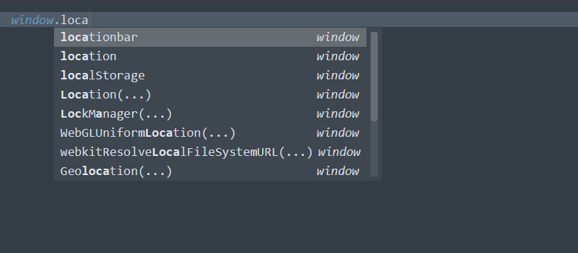

# Resolve JS Modules
This plugin for Sublime Text 3 adds completions for es modules, import file paths and browser api's. 

# How it works
The imports are parsed from the beginning of the file, it looks at wildcard imports of the form `import * as xyz from './relative/path.js'`. Then the module is parsed using a python port of `esprima` and cached for later use. The implementation is fully written in python without external dependencies.

# Why
There are other plugins available but I find that they have performance problems and bugs. This plugin focuses on performance and javascript specific functionality.

# Regenerating browser completions
Open `get_browser_completions.html` in a browser and copy the console.log to a file `browser_completions.json`. You can also change the file contents to `{}` to disable browser completions or add your own there.

# limitations
- nested objects are not completed fully
- re-exports are ignored
- parsing is done on the main thread (but is cached)
- only supports relative paths for imports

# esprima
esprima python port is found at: https://github.com/Kronuz/esprima-python
esprima itself is found at: https://esprima.org/